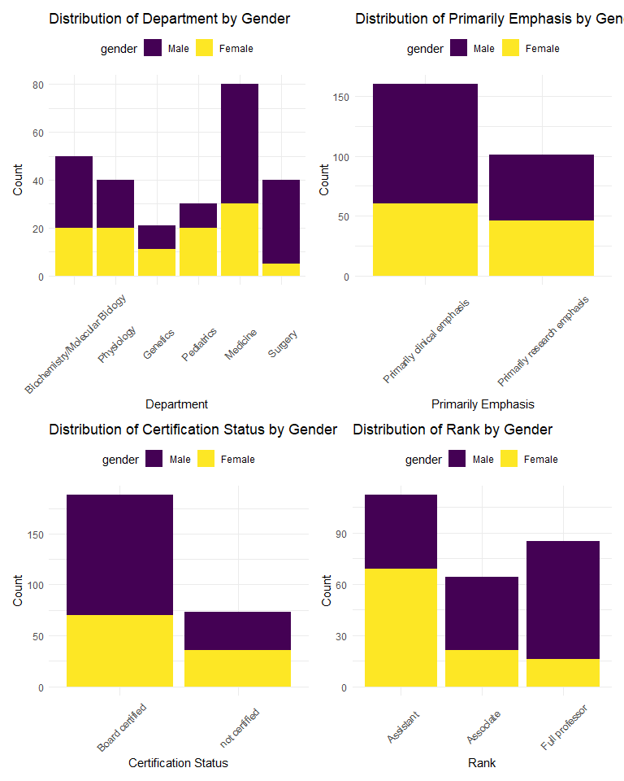
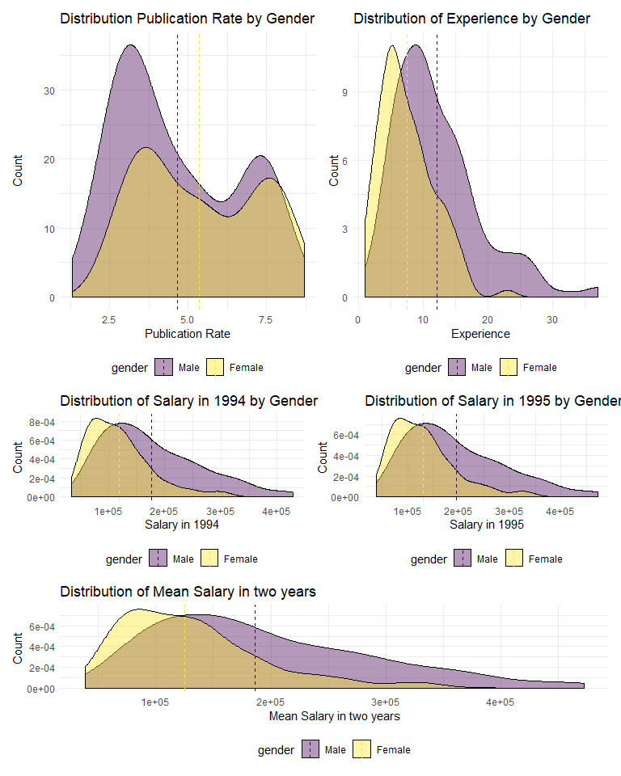

data description
================
Guangling Xu
2019/12/5

**Table 1: Summary Statistics of lawsuit Data**

|                                    |            Male (N=155)             |           Female (N=106)           |           Total (N=261)            |              p value |
| :--------------------------------- | :---------------------------------: | :--------------------------------: | :--------------------------------: | -------------------: |
| **Department**                     |                                     |                                    |                                    | \< 0.0011 |
| Biochemistry/Molecular Biology     |             30 (19.4%)              |             20 (18.9%)             |             50 (19.2%)             |                      |
| Physiology                         |             20 (12.9%)              |             20 (18.9%)             |             40 (15.3%)             |                      |
| Genetics                           |              10 (6.5%)              |             11 (10.4%)             |             21 (8.0%)              |                      |
| Pediatrics                         |              10 (6.5%)              |             20 (18.9%)             |             30 (11.5%)             |                      |
| Medicine                           |             50 (32.3%)              |             30 (28.3%)             |             80 (30.7%)             |                      |
| Surgery                            |             35 (22.6%)              |              5 (4.7%)              |             40 (15.3%)             |                      |
| Missing                            |                  0                  |                 0                  |                 0                  |                      |
| **Clinical Emphasis**              |                                     |                                    |                                    |    0.1971 |
| Primarily clinical emphasis        |             100 (64.5%)             |             60 (56.6%)             |            160 (61.3%)             |                      |
| Primarily research emphasis        |             55 (35.5%)              |             46 (43.4%)             |            101 (38.7%)             |                      |
| Missing                            |                  0                  |                 0                  |                 0                  |                      |
| **Certification**                  |                                     |                                    |                                    |    0.0741 |
| Board certified                    |             118 (76.1%)             |             70 (66.0%)             |            188 (72.0%)             |                      |
| not certified                      |             37 (23.9%)              |             36 (34.0%)             |             73 (28.0%)             |                      |
| Missing                            |                  0                  |                 0                  |                 0                  |                      |
| **Publication Rate**               |                                     |                                    |                                    |    0.0022 |
| Mean (SD)                          |            4.646 (1.938)            |           5.350 (1.886)            |           4.932 (1.944)            |                      |
| Median (Q1, Q3)                    |        4.000 (3.100, 6.700)         |        5.250 (3.725, 7.275)        |        4.400 (3.200, 6.900)        |                      |
| Min - Max                          |            1.300 - 8.600            |           2.400 - 8.700            |           1.300 - 8.700            |                      |
| Missing                            |                  0                  |                 0                  |                 0                  |                      |
| **Experience**                     |                                     |                                    |                                    | \< 0.0012 |
| Mean (SD)                          |           12.103 (6.704)            |           7.491 (4.166)            |           10.230 (6.227)           |                      |
| Median (Q1, Q3)                    |       10.000 (7.000, 15.000)        |       7.000 (5.000, 10.000)        |       9.000 (6.000, 14.000)        |                      |
| Min - Max                          |           2.000 - 37.000            |           1.000 - 23.000           |           1.000 - 37.000           |                      |
| Missing                            |                  0                  |                 0                  |                 0                  |                      |
| **Rank**                           |                                     |                                    |                                    | \< 0.0011 |
| Assistant                          |             43 (27.7%)              |             69 (65.1%)             |            112 (42.9%)             |                      |
| Associate                          |             43 (27.7%)              |             21 (19.8%)             |             64 (24.5%)             |                      |
| Full professor                     |             69 (44.5%)              |             16 (15.1%)             |             85 (32.6%)             |                      |
| Missing                            |                  0                  |                 0                  |                 0                  |                      |
| **Salary in 1994**                 |                                     |                                    |                                    | \< 0.0012 |
| Mean (SD)                          |       177338.761 (85930.540)        |       118871.274 (56168.006)       |       153593.345 (80469.667)       |                      |
| Median (Q1, Q3)                    | 155006.000 (109687.000, 231501.500) | 108457.000 (75774.500, 143096.000) | 133284.000 (90771.000, 200543.000) |                      |
| Min - Max                          |       52582.000 - 428876.000        |       34514.000 - 308081.000       |       34514.000 - 428876.000       |                      |
| Missing                            |                  0                  |                 0                  |                 0                  |                      |
| **Salary after Increment in 1995** |                                     |                                    |                                    | \< 0.0012 |
| Mean (SD)                          |       194914.090 (94902.728)        |       130876.915 (62034.507)       |       168906.655 (88778.425)       |                      |
| Median (Q1, Q3)                    | 170967.000 (119952.500, 257163.000) | 119135.000 (82345.250, 154170.500) | 148117.000 (99972.000, 218955.000) |                      |
| Min - Max                          |       58923.000 - 472589.000        |       38675.000 - 339664.000       |       38675.000 - 472589.000       |                      |
| Missing                            |                  0                  |                 0                  |                 0                  |                      |

1.  Pearson’s Chi-squared test
2.  Kruskal-Wallis rank sum test

<!-- end list -->

  - Values are count(percentage) for categorical variables or mean(SD),
    median(25% quantile, 75% quantile), min-max, count of missing values
    for continuous variables.\* Publication Rate: Number of years
    between CV date and MD date;Experience: Number of years since
    obtaining MD; Rank: a proxy for productivity

# Data Description

Among the 261 participants in this study, 40.6% (n = 106) were female.
As shown in *Table 1, Graph 1*, participants who were female were more
likely to be in the department of medicine , premarily clinical
emphasis, board certified and assistant. Participants who were male were
more likely to be in the department of medicine, premarily clinical
emphasis, board certified, full professor.The mean publication rate was
4.6(sd = 1.9) for male and 5.4(sd = 1.9) for female. The mean number of
years since obtaining MD was 12.1(sd = 6.7)for male and 7.5(sd = 4.2)
for female. The mean salary in 1994 was 177338.8(sd = 85930.5) for male
and 118871.3(sd = 56168.0) for female. Salary after increment in 1995
was 194914.1(sd = 94902.7) for male and 130876.9(sd = 88778.4) for
female.

# Data Distribution

In *Graph 1*, distributions of publication rate among male and female
are alike.The publication rate of male concentrated around 3 pieces per
year and 7.4 pieces per year,The publication rate of female concentrated
around 3.7 pieces per year and 7.6 per year.Female published faster than
male on average. Plot of distribution of number of years since obtaining
MD showed that female, on average, had less experiences than male.The
distributions of two genders were all right-skewed, meaning there were
some extreme high values of experiences. Distribution plot of salary in
1994 indicated that female earned less than male on average.Some extreme
high values of salary biased the distribution into right-skewed.
Distribution plot of salary in 1995 after increment illustrated that
female earned less than male on average.Some extreme high values of
salary biased the distribution into right-skewed. Overall, salary
distribution in 1994 and 1995 looks alike.Therefore, mean of these two
years were used in our model as the response.

**Graph 1: Distribution of Categorical predictors and Continuous
predictors in lawsuit dataset.Grouped by gender**

## Transformation
