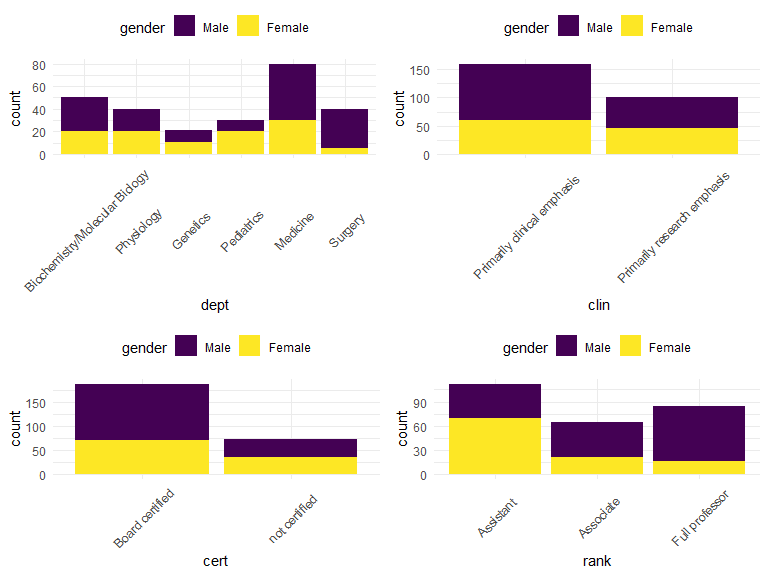

data description
================
Guangling Xu
2019/12/5

### Table 1

Summarizing all variables by Gender(the main covariate of interest)

    ## [1] "<table class=\"Rtable1\">\n<thead>\n<tr>\n<th class='rowlabel firstrow lastrow'></th>\n<th class='firstrow lastrow'><span class='stratlabel'>Male<br><span class='stratn'>(n=155)</span></span></th>\n<th class='firstrow lastrow'><span class='stratlabel'>Female<br><span class='stratn'>(n=106)</span></span></th>\n<th class='firstrow lastrow'><span class='stratlabel'>Overall<br><span class='stratn'>(n=261)</span></span></th>\n</tr>\n</thead>\n<tbody>\n<tr>\n<td class='rowlabel firstrow'><span class='varlabel'>Department</span></td>\n<td class='firstrow'></td>\n<td class='firstrow'></td>\n<td class='firstrow'></td>\n</tr>\n<tr>\n<td class='rowlabel'>Biochemistry/Molecular Biology</td>\n<td>30 (19.4%)</td>\n<td>20 (18.9%)</td>\n<td>50 (19.2%)</td>\n</tr>\n<tr>\n<td class='rowlabel'>Physiology</td>\n<td>20 (12.9%)</td>\n<td>20 (18.9%)</td>\n<td>40 (15.3%)</td>\n</tr>\n<tr>\n<td class='rowlabel'>Genetics</td>\n<td>10 (6.5%)</td>\n<td>11 (10.4%)</td>\n<td>21 (8.0%)</td>\n</tr>\n<tr>\n<td class='rowlabel'>Pediatrics</td>\n<td>10 (6.5%)</td>\n<td>20 (18.9%)</td>\n<td>30 (11.5%)</td>\n</tr>\n<tr>\n<td class='rowlabel'>Medicine</td>\n<td>50 (32.3%)</td>\n<td>30 (28.3%)</td>\n<td>80 (30.7%)</td>\n</tr>\n<tr>\n<td class='rowlabel lastrow'>Surgery</td>\n<td class='lastrow'>35 (22.6%)</td>\n<td class='lastrow'>5 (4.7%)</td>\n<td class='lastrow'>40 (15.3%)</td>\n</tr>\n<tr>\n<td class='rowlabel firstrow'><span class='varlabel'>Clinical Emphasis</span></td>\n<td class='firstrow'></td>\n<td class='firstrow'></td>\n<td class='firstrow'></td>\n</tr>\n<tr>\n<td class='rowlabel'>Primarily clinical emphasis</td>\n<td>100 (64.5%)</td>\n<td>60 (56.6%)</td>\n<td>160 (61.3%)</td>\n</tr>\n<tr>\n<td class='rowlabel lastrow'>Primarily research emphasis</td>\n<td class='lastrow'>55 (35.5%)</td>\n<td class='lastrow'>46 (43.4%)</td>\n<td class='lastrow'>101 (38.7%)</td>\n</tr>\n<tr>\n<td class='rowlabel firstrow'><span class='varlabel'>Certified</span></td>\n<td class='firstrow'></td>\n<td class='firstrow'></td>\n<td class='firstrow'></td>\n</tr>\n<tr>\n<td class='rowlabel'>Board certified</td>\n<td>118 (76.1%)</td>\n<td>70 (66.0%)</td>\n<td>188 (72.0%)</td>\n</tr>\n<tr>\n<td class='rowlabel lastrow'>not certified</td>\n<td class='lastrow'>37 (23.9%)</td>\n<td class='lastrow'>36 (34.0%)</td>\n<td class='lastrow'>73 (28.0%)</td>\n</tr>\n<tr>\n<td class='rowlabel firstrow'><span class='varlabel'>Publication Rate</span></td>\n<td class='firstrow'></td>\n<td class='firstrow'></td>\n<td class='firstrow'></td>\n</tr>\n<tr>\n<td class='rowlabel'>Mean (SD)</td>\n<td>4.65 (1.94)</td>\n<td>5.35 (1.89)</td>\n<td>4.93 (1.94)</td>\n</tr>\n<tr>\n<td class='rowlabel lastrow'>Median [Min, Max]</td>\n<td class='lastrow'>4.00 [1.30, 8.60]</td>\n<td class='lastrow'>5.25 [2.40, 8.70]</td>\n<td class='lastrow'>4.40 [1.30, 8.70]</td>\n</tr>\n<tr>\n<td class='rowlabel firstrow'><span class='varlabel'>Experience</span></td>\n<td class='firstrow'></td>\n<td class='firstrow'></td>\n<td class='firstrow'></td>\n</tr>\n<tr>\n<td class='rowlabel'>Mean (SD)</td>\n<td>12.1 (6.70)</td>\n<td>7.49 (4.17)</td>\n<td>10.2 (6.23)</td>\n</tr>\n<tr>\n<td class='rowlabel lastrow'>Median [Min, Max]</td>\n<td class='lastrow'>10.0 [2.00, 37.0]</td>\n<td class='lastrow'>7.00 [1.00, 23.0]</td>\n<td class='lastrow'>9.00 [1.00, 37.0]</td>\n</tr>\n<tr>\n<td class='rowlabel firstrow'><span class='varlabel'>Rank</span></td>\n<td class='firstrow'></td>\n<td class='firstrow'></td>\n<td class='firstrow'></td>\n</tr>\n<tr>\n<td class='rowlabel'>Assistant</td>\n<td>43 (27.7%)</td>\n<td>69 (65.1%)</td>\n<td>112 (42.9%)</td>\n</tr>\n<tr>\n<td class='rowlabel'>Associate</td>\n<td>43 (27.7%)</td>\n<td>21 (19.8%)</td>\n<td>64 (24.5%)</td>\n</tr>\n<tr>\n<td class='rowlabel lastrow'>Full professor</td>\n<td class='lastrow'>69 (44.5%)</td>\n<td class='lastrow'>16 (15.1%)</td>\n<td class='lastrow'>85 (32.6%)</td>\n</tr>\n<tr>\n<td class='rowlabel firstrow'><span class='varlabel'>Salary in 1994</span></td>\n<td class='firstrow'></td>\n<td class='firstrow'></td>\n<td class='firstrow'></td>\n</tr>\n<tr>\n<td class='rowlabel'>Mean (SD)</td>\n<td>177000 (85900)</td>\n<td>119000 (56200)</td>\n<td>154000 (80500)</td>\n</tr>\n<tr>\n<td class='rowlabel lastrow'>Median [Min, Max]</td>\n<td class='lastrow'>155000 [52600, 429000]</td>\n<td class='lastrow'>108000 [34500, 308000]</td>\n<td class='lastrow'>133000 [34500, 429000]</td>\n</tr>\n<tr>\n<td class='rowlabel firstrow'><span class='varlabel'>Salary after Increment</span></td>\n<td class='firstrow'></td>\n<td class='firstrow'></td>\n<td class='firstrow'></td>\n</tr>\n<tr>\n<td class='rowlabel'>Mean (SD)</td>\n<td>195000 (94900)</td>\n<td>131000 (62000)</td>\n<td>169000 (88800)</td>\n</tr>\n<tr>\n<td class='rowlabel lastrow'>Median [Min, Max]</td>\n<td class='lastrow'>171000 [58900, 473000]</td>\n<td class='lastrow'>119000 [38700, 340000]</td>\n<td class='lastrow'>148000 [38700, 473000]</td>\n</tr>\n</tbody>\n</table>\n"

``` r
library(arsenal)
my_controls <- tableby.control(
  test = T,
  total = T,
  numeric.test = "kwt", cat.test = "chisq",
  numeric.stats = c("meansd", "medianq1q3", "range", "Nmiss2"),
  cat.stats = c("countpct", "Nmiss2"),
  stats.labels = list(
    meansd = "Mean (SD)",
    medianq1q3 = "Median (Q1, Q3)",
    range = "Min - Max",
    Nmiss2 = "Missing"
  )
)
 
my_labels <- list(
  dept = "Department",
  clin = "Clinical Emphasis",
  cert = "Certification",
  prate = "Publication Rate",
  exper = "Experience",
  rank = "Rank",
  sal94 = "Salary in 1994",
  sal95 = "Salary after Increment"
)

 
table_two <- tableby(gender ~ .,
  data = lawsuit,
  control = my_controls
)
 
summary(table_two,
  labelTranslations = my_labels,
  title = "Summary Statistic of lawsuit Data",
  pfootnote = TRUE,text = FALSE
)
```

|                                |            Male (N=155)             |           Female (N=106)           |           Total (N=261)            |              p value |
| :----------------------------- | :---------------------------------: | :--------------------------------: | :--------------------------------: | -------------------: |
| **id**                         |                                     |                                    |                                    |    0.764<sup>1</sup> |
| Mean (SD)                      |          132.161 (80.680)           |          129.302 (67.519)          |          131.000 (75.488)          |                      |
| Median (Q1, Q3)                |      149.000 (59.500, 187.500)      |     123.500 (77.250, 199.750)      |     131.000 (66.000, 196.000)      |                      |
| Min - Max                      |           1.000 - 256.000           |          31.000 - 261.000          |          1.000 - 261.000           |                      |
| Missing                        |                  0                  |                 0                  |                 0                  |                      |
| **Department**                 |                                     |                                    |                                    | \< 0.001<sup>2</sup> |
| Biochemistry/Molecular Biology |             30 (19.4%)              |             20 (18.9%)             |             50 (19.2%)             |                      |
| Physiology                     |             20 (12.9%)              |             20 (18.9%)             |             40 (15.3%)             |                      |
| Genetics                       |              10 (6.5%)              |             11 (10.4%)             |             21 (8.0%)              |                      |
| Pediatrics                     |              10 (6.5%)              |             20 (18.9%)             |             30 (11.5%)             |                      |
| Medicine                       |             50 (32.3%)              |             30 (28.3%)             |             80 (30.7%)             |                      |
| Surgery                        |             35 (22.6%)              |              5 (4.7%)              |             40 (15.3%)             |                      |
| Missing                        |                  0                  |                 0                  |                 0                  |                      |
| **Clinical Emphasis**          |                                     |                                    |                                    |    0.197<sup>2</sup> |
| Primarily clinical emphasis    |             100 (64.5%)             |             60 (56.6%)             |            160 (61.3%)             |                      |
| Primarily research emphasis    |             55 (35.5%)              |             46 (43.4%)             |            101 (38.7%)             |                      |
| Missing                        |                  0                  |                 0                  |                 0                  |                      |
| **Certification**              |                                     |                                    |                                    |    0.074<sup>2</sup> |
| Board certified                |             118 (76.1%)             |             70 (66.0%)             |            188 (72.0%)             |                      |
| not certified                  |             37 (23.9%)              |             36 (34.0%)             |             73 (28.0%)             |                      |
| Missing                        |                  0                  |                 0                  |                 0                  |                      |
| **Publication Rate**           |                                     |                                    |                                    |    0.002<sup>1</sup> |
| Mean (SD)                      |            4.646 (1.938)            |           5.350 (1.886)            |           4.932 (1.944)            |                      |
| Median (Q1, Q3)                |        4.000 (3.100, 6.700)         |        5.250 (3.725, 7.275)        |        4.400 (3.200, 6.900)        |                      |
| Min - Max                      |            1.300 - 8.600            |           2.400 - 8.700            |           1.300 - 8.700            |                      |
| Missing                        |                  0                  |                 0                  |                 0                  |                      |
| **Experience**                 |                                     |                                    |                                    | \< 0.001<sup>1</sup> |
| Mean (SD)                      |           12.103 (6.704)            |           7.491 (4.166)            |           10.230 (6.227)           |                      |
| Median (Q1, Q3)                |       10.000 (7.000, 15.000)        |       7.000 (5.000, 10.000)        |       9.000 (6.000, 14.000)        |                      |
| Min - Max                      |           2.000 - 37.000            |           1.000 - 23.000           |           1.000 - 37.000           |                      |
| Missing                        |                  0                  |                 0                  |                 0                  |                      |
| **Rank**                       |                                     |                                    |                                    | \< 0.001<sup>2</sup> |
| Assistant                      |             43 (27.7%)              |             69 (65.1%)             |            112 (42.9%)             |                      |
| Associate                      |             43 (27.7%)              |             21 (19.8%)             |             64 (24.5%)             |                      |
| Full professor                 |             69 (44.5%)              |             16 (15.1%)             |             85 (32.6%)             |                      |
| Missing                        |                  0                  |                 0                  |                 0                  |                      |
| **Salary in 1994**             |                                     |                                    |                                    | \< 0.001<sup>1</sup> |
| Mean (SD)                      |       177338.761 (85930.540)        |       118871.274 (56168.006)       |       153593.345 (80469.667)       |                      |
| Median (Q1, Q3)                | 155006.000 (109687.000, 231501.500) | 108457.000 (75774.500, 143096.000) | 133284.000 (90771.000, 200543.000) |                      |
| Min - Max                      |       52582.000 - 428876.000        |       34514.000 - 308081.000       |       34514.000 - 428876.000       |                      |
| Missing                        |                  0                  |                 0                  |                 0                  |                      |
| **Salary after Increment**     |                                     |                                    |                                    | \< 0.001<sup>1</sup> |
| Mean (SD)                      |       194914.090 (94902.728)        |       130876.915 (62034.507)       |       168906.655 (88778.425)       |                      |
| Median (Q1, Q3)                | 170967.000 (119952.500, 257163.000) | 119135.000 (82345.250, 154170.500) | 148117.000 (99972.000, 218955.000) |                      |
| Min - Max                      |       58923.000 - 472589.000        |       38675.000 - 339664.000       |       38675.000 - 472589.000       |                      |
| Missing                        |                  0                  |                 0                  |                 0                  |                      |

Summary Statistic of lawsuit Data

1.  Kruskal-Wallis rank sum test
2.  Pearson’s Chi-squared test

## Results

Among the 261 participants in this study, 40.6% (n = 106) were female.
As shown in *Table 1*, participants who were female were more likely to
be in the department of Medicine , premarily clinical emphasis, board
certified and assistant. The mean publication rate was 4.6(sd = 1.9) for
male and 5.4(sd = 1.9) for female. The mean number of years since
obtaining MD was 12.1(sd = 6.7)for male and 7.5(sd = 4.2) for female.
The mean salary in 1994 was 177338.8(sd = 85930.5) for male and
118871.3(sd = 56168.0) for female. Salary after increment was
194914.1(sd = 94902.7) for male and 130876.9(sd = 88778.4) for female.

### Distribution



## Transformation

Use box cox to do transformation for sal94 and sal95
